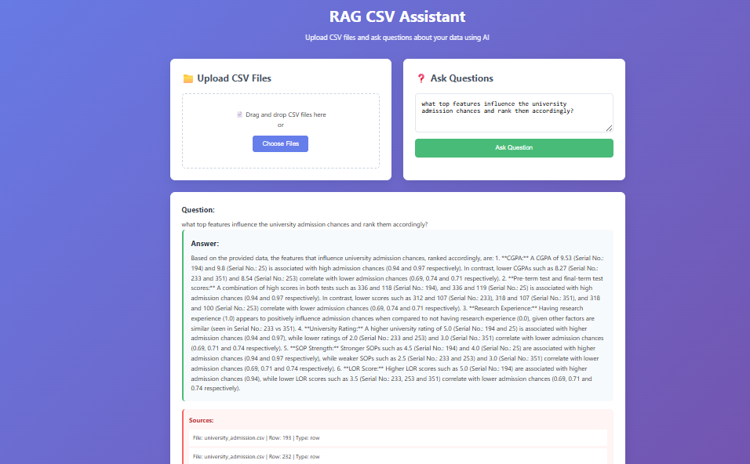

# RAG CSV Assistant

A full-stack Retrieval-Augmented Generation (RAG) application that allows users to upload CSV files and ask questions about their data using Google's Gemini AI.
# Preview

## Features

- **CSV File Upload**: Drag-and-drop or click to upload CSV files
- **Intelligent Processing**: Automatically chunks CSV data into searchable segments
- **Vector Search**: Uses ChromaDB for efficient similarity search
- **AI-Powered Answers**: Leverages Google Gemini for natural language responses
- **Source Attribution**: Shows which parts of your data were used to generate answers
- **Web Interface**: Clean, responsive web UI for easy interaction

## Setup Instructions

### 1. Install Dependencies

\`\`\`bash
pip install -r requirements.txt
\`\`\`

### 2. Configure Environment Variables

Create a `.env` file in the project root:

\`\`\`env
GEMINI_API_KEY=your_gemini_api_key_here
FLASK_ENV=development
PORT=5000
\`\`\`

**Get your Gemini API Key:**
1. Go to [Google AI Studio](https://makersuite.google.com/app/apikey)
2. Create a new API key
3. Copy the key to your `.env` file

### 3. Run the Application

\`\`\`bash
python app.py
\`\`\`

The application will be available at `http://localhost:5000`

## How It Works

### Data Processing Pipeline

1. **CSV Upload**: Users upload CSV files through the web interface
2. **Chunking**: The system creates two types of chunks:
   - **Row chunks**: Each row becomes a searchable text chunk
   - **Column summaries**: Statistical and categorical summaries of each column
3. **Embedding**: Text chunks are converted to vector embeddings using SentenceTransformers
4. **Storage**: Embeddings and metadata are stored in ChromaDB

### Query Processing

1. **Question Embedding**: User questions are converted to vector embeddings
2. **Similarity Search**: ChromaDB finds the most relevant chunks
3. **Context Assembly**: Retrieved chunks are formatted as context
4. **AI Generation**: Gemini generates answers based on the context
5. **Response**: Answer is returned with source attribution

## API Endpoints

- `GET /` - Main web interface
- `POST /upload` - Upload CSV files
- `POST /query` - Ask questions about uploaded data
- `GET /status` - Check system status
- `POST /reset` - Reset the vector database

## Example Usage

1. Upload a CSV file with sales data
2. Ask questions like:
   - "What is the average sales amount?"
   - "Which product has the highest revenue?"
   - "How many customers are from California?"
   - "What are the unique product categories?"

## Technical Architecture

- **Backend**: Flask web framework
- **Vector Database**: ChromaDB for persistent storage
- **Embeddings**: SentenceTransformers (all-MiniLM-L6-v2)
- **LLM**: Google Gemini Pro
- **Frontend**: Vanilla HTML/CSS/JavaScript

## File Structure

\`\`\`
rag-csv-assistant/
├── app.py              # Main Flask application
├── rag_system.py       # RAG system implementation
├── requirements.txt    # Python dependencies
├── .env               # Environment variables
├── templates/
│   └── index.html     # Web interface
├── uploads/           # Uploaded CSV files
└── chroma_db/         # ChromaDB persistent storage
\`\`\`

## Troubleshooting

### Common Issues

1. **"GEMINI_API_KEY not found"**
   - Make sure your `.env` file contains the correct API key
   - Verify the API key is valid in Google AI Studio

2. **"No relevant information found"**
   - Upload CSV files first before asking questions
   - Make sure your questions relate to the data in your CSV files

3. **Upload fails**
   - Ensure files are in CSV format
   - Check file size (max 16MB)
   - Verify CSV files are properly formatted

### Reset Database

If you encounter issues with the vector database, use the "Reset Database" button in the web interface to clear all stored data.

## Customization

### Modify Chunking Strategy

Edit the `create_chunks_from_csv()` method in `rag_system.py` to change how CSV data is processed.

### Change Embedding Model

Modify the `setup_embeddings()` method to use different SentenceTransformer models.

### Adjust Retrieval Parameters

Change the `top_k` parameter in the `query()` method to retrieve more or fewer relevant chunks.

### CREATED AND LICENCED BY
 Akash Katte
